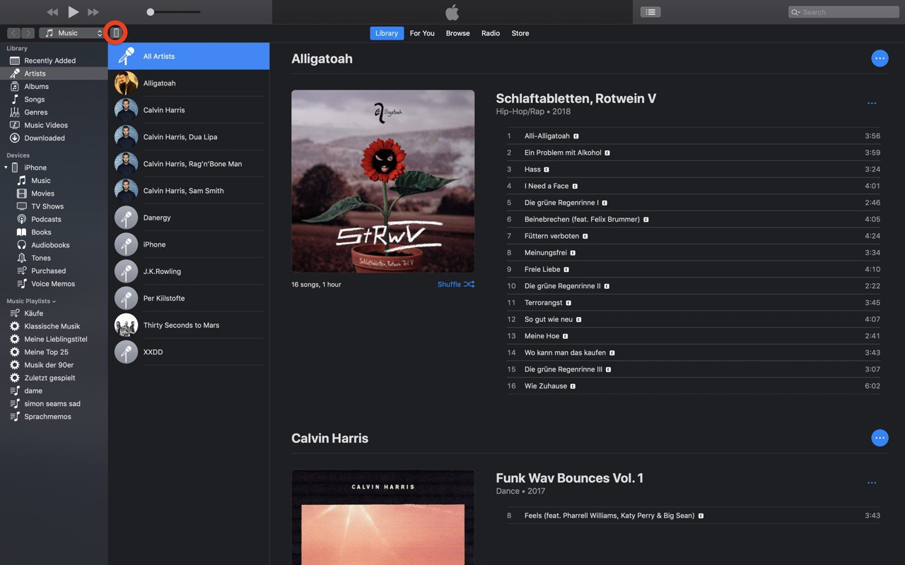
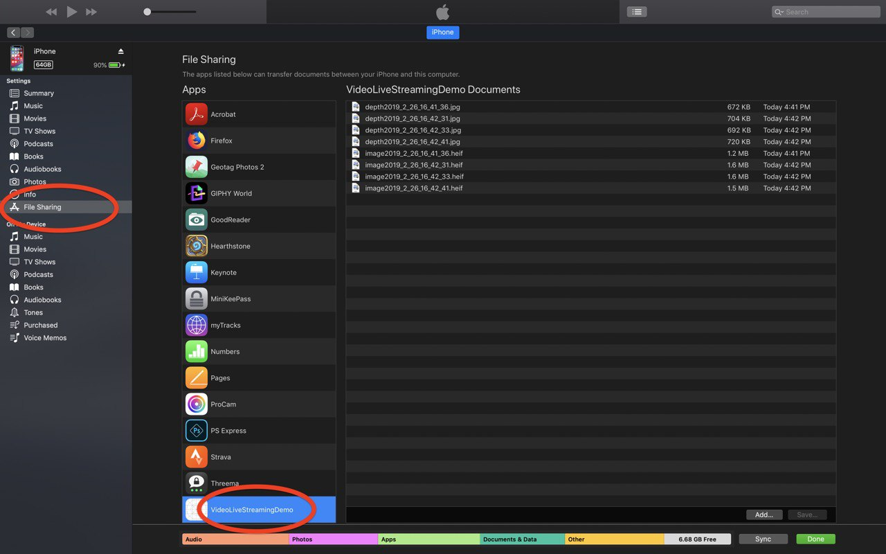
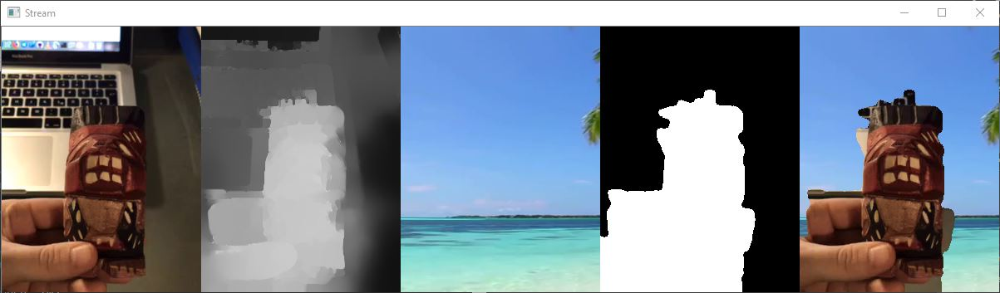

<!--# Recording Depth with Dual-Camera Smartphone-->
<!--

-->
## Aufgabenstellung
In jüngster Zeit wurden von mehreren Herstellern Smartphones, wie zum Beispiel dem [iPhone 7 Plus][1] und dem [Samsung Galaxy s9][2], Geräte mit zwei Kameras veröffentlicht. Dies ermöglicht es dem Endbenutzer zum Beispiel Bokeh Effekte mit dem Handy zu kreieren. <!--Dies war bis zu diesem Zeitpunkt nur mit High-End-Kameras möglich.--> Des weiteren erlauben Stereo Kamera Setups eine 3D Rekonstruktion aus den verfügbaren Tiefendaten.
Im Rahmen dieses Projekts wurde daher eine Swift App entwickelt die es dem Anwender ermöglicht, die mit Hilfe eines [iPhones mit zwei Kameras wie dem iPhone 7 Plus][1] gesammelten Bild- und Tiefendaten aufzuzeichnen und sie über das lokale Netzwerk an einen Webserver zu streamen wo sie dann in einem C++ Programm mit der [OpenCV Library][12] weiter verarbeitet werden. Ziel dieses Projektes ist eine verlustfreie Übertragung der Tiefendaten vom einem iPhone auf einen PC, um sie im wissenschaftlichen Bereich zu Entwicklung von neuen Anwendungen basierend auf den Tiefendaten ohne die Performance-Einschränkungen des Smartphones nutzen zu können.

<!--## Starting the Application

1) Start the Apache Server (for example XAMPP) on your Computer
2) Configure the desired Settings on Top of the Main.cpp
3) Start the C++ Program
4) Configure the Swift Application in the streamingConfiguration.plist file by setting size and streaming destination (or you can change the settings in the App itself).
5) Start the Swift-App and start streaming
-->
## Starten der Anwendung
1) Starten Sie den Apache Server (zum Beispiel [XAMPP][20] oder [MAMP][21]) auf Ihrem Computer
2) Konfigurieren Sie die gewünschten Einstellungen am Beginn der Main.cpp
3) Starten Sie das C++ - Programm
4) Konfigurieren Sie die Swift-Anwendung in der Datei streamingConfiguration.plist, indem Sie Größe und Streamingziel festlegen.
5) Starten Sie die Swift-App und starten Sie dort die Übertragung

## Implementierung
In diesem Abschnitt wird die Implementierung des Projekts beschrieben. Das Projekt an sich ist in zwei Teile gegliedert: Einerseits die Swift App, welche die Video- und Tiefendaten aufzeichnet und diese auf einen Webserver streamt und andererseits einem C++ Programm, das als beispielhafter Anwendungsfall für die Verarbeitung dieser Daten dient.

### Swift App
Im Folgenden wird genauer auf die Implementierung der Swift App eingegangen. Die benötigten Video- und Tiefendaten werden durch Apple's Medien-Framework [AVFoundation][3] gesammelt. Die als Float16-Pixelbuffer vorliegenden Tiefendaten müssen vor der Übertragung in das Datenformat Int8 konvertiert werden. Die Übertragung wird mittels der [HLS (HTTP Live Streaming)][4] Architektur realisiert.

#### Aufzeichnung mit AVFoundation
Für die Aufzeichnung und Sammlung der zeitbasierten audiovisuellen Medien wurde das von Apple bereitgestellte Framework [AVFoundation][3] verwendet. Es stellt unter anderem die Schnittstelle zwischen der Kamera Hardware des Devices und der Software dar. Die Aufnahmen der Kameras werden durch `capture sessions` verwaltet. Eine `capture session` koordiniert den Datenfluss von der Eingabe bis zum Abspeichern der einzelnen Videos. Um die aufgenommen Video- beziehungsweise Tiefenframes zu verarbeiten, wird `AVCaptureVideoDataOutput()` bzw. `AVCaptureDepthDataOutput()` verwendet. `AVCaptureDataOutputSynchronizerDelegate` dient dazu, die erfassten Daten/Frames der beiden CaptureOutputs anhand des zugewiesenen Timestamps zu synchronisieren. Die synchronisierten Daten werden dann mithilfe eines [AVAssetWriter][6] (RGB) bzw. der [Data][14] Klasse in das File System geschrieben.
Die Daten direkt streamen ohne sie vorher abzuspeichern ist leider nicht möglich, da sie nur in gestückelten Files gesendet werden können.

#### Vorverarbeitung der Tiefendaten
Da die Tiefendaten nicht wie die RGB-Daten als Bild, sondern als Pixelbuffer vorliegen, müssen wir die Daten der Pixelbuffer der einzelnen Frames zusammenhängen. Wir nennen diese Methode die binäre Methode, da die Bytes der Werte des Pixelbuffers einfach aneinander gehängt werden. Zuvor hatten wir versucht wie von Apple angedacht ([Sample Code][10]), den Pixelbuffer in ein Graustufenbild zu rendern und diese zusammengehängt als MPEG-Video zu übertragen, jedoch stellte sich ein enormer Genauigkeitsverlust durch die MPEG-Komprimierung heraus.

Die Tiefendaten werden als Disparität übertragen, was dem Versatz eines Bildpunktes in beiden Kameras entspricht. Die Disparität entspricht dem Wert 1/Distanz eines Objektes. Zur Übertragung werden die Disparität Werte zunächst in den Bereich 0 bis 1 normalisiert (Standardwerte: minDisparität=0, maxDisparität=5) und dann auf den Bereich des verwendeten Datentypes (Int8) zur Übertragung skaliert:
```
DisparityNormalized = (Disparity - minDisparity) / (maxDisparity - minDisparity)

DisparityInt8 = truncate(255 * DisparityNormalized)
```
Die Disparität ist als Float16 gegeben, also würde prinzipiell Int16 zur Übertragung genauer sein, jedoch entspricht das einer Speichergröße bei 23 Frames von 240 * 320 * 2 * 23 ~ 3,5 MB (~150 KB pro Frame), was sich nicht innerhalb 1 Sekunde streamen lässt. Zippen bringt hier auch nicht viel, da benachbarte Pixel doch geringe Unterschiede haben und somit wenig effizient komprimiert werden kann. Wir verwenden Int8 zur Übertragung, weil durch das Abschneiden auf die geringere Genauigkeit benachbarte Pixel mit geringem Unterschied exakt denselben Wert bekommen und damit Zip effizienter komprimieren kann. PNG (auch mit 8 Bit Genauigkeit) haben wir auch versucht, jedoch mit schlechterem Komprimierungsergebnis wie der folgendende Vergleich zeigt. Da das Senden einer Streaming Einheit alle x Sekunden erfolgt, kann die Anzahl an Frames einer Streaming Einheit variieren abhängig davon, wie lange die einzelnen Frames zum Verarbeiten brauchen. Deswegen sollte zum Vergleich der Methoden das Ergebnis pro Frame herangezogen werden:
<!-- remove one

PNG (8 Bit): 31 - 32 KB => 25 PNG: 800KB => 25 PNG gezippt: 778 - 785KB => entspricht ~31KB pro Frame

25 PNG (8 Bit) horizontal zusammengefügt: 500KB => gezippt: 500KB => 20KB pro Frame

1 BINÄR (8 Bit): 75KB => 1800KB => 24 BINÄR gezippt: 339KB => ~14KB pro Frame

-->

|                                          | 1 Frame    | 1 Streaming Einheit | Gezippt                     | Ergebnis pro Frame |
| :--------------------------------------- | :--------- | :------------------ | :-------------------------- | :----------------- |
| PNG (8 Bit)                              | 32 KB 		| 25 PNG: 800KB       | 778 - 785KB                 | ~31KB pro Frame    |
| PNG (8 Bit) horizontal zusammengefügt    | 32 KB		| 25 PNG: 500KB       | 500KB                       | ~20KB pro Frame    |
| BINÄR (8 Bit)                            | 75KB       | 24 BINÄR: 1800KB    | 339KB                       | ~14KB pro Frame    |


Also im Vergleich zu den ursprünglichen ~150 KB pro Frame eine Größeneinsparung um fast den Faktor 11.

Durch die inverse Natur der Disparität (1/Distanz) wirkt sich diese Ungenauigkeit durch die Übertragung von Float16 als Int8 am Stärksten für weit entfernte Objekte aus, wo die Disparitätmessung ohnehin an die Grenzen der Pixelauflösug stößt und damit diese Ungenauigkeit durch das Abschneiden auf Int8 vernachlässigbar ist.

#### Übertragung: RGB
Die Übertragung wird mit Hilfe der [HLS (HTTP Live Streaming)][4] Architektur verwirklicht. Bei diesem Verfahren wird das Video / die Daten zuerst in Stücken abgespeichert und jedes Stück einzeln gesendet. Die Video-Stücke werden in einen MPEG Transport Stream Container gepackt, damit sie gestreamt werden können. Diese werden nun einzeln an einen Apache Server gesendet und über ein PHP Script am Server abgespeichert. Dieses PHP Script wird beim Start vom C++ Programm automatisch abgespeichert sofern es noch nicht vorhanden ist.
<!---Diese werden als ’.ts’ –Files (MPEG-2 Transport Stream) abgespeichert[5]. Die einzelnen Files werden in [.M3U8][7] Playlisten zusammengefasst. Ein ‘Timer.scheduledTimer()‘[9]- Befehl wird dazu verwendet, dass die einzelnen Stücke des Streams mit einer vordefinierten Frequenz an einen Client (in diesem Fall einen Webserver) gesendet werden. ‘URLSession.shared.uploadTask‘[8] macht einen HTTP Request und sendet die Daten dann an den Server.-->


#### Übertragung: Tiefendaten
Nachdem die auf Int8 Genauigkeit abgeschnittenen Disparitätswerte der einzelnen Frames in ein einzelnes Array zusammenkopiert und in eine Datei gespeichert wurde, wird die Datei gezippt und mit HLS übertragen. Am Server wird das Zip empfangen und die Datei vom PHP-Script wieder entpackt.

#### Bedienung App
Auf dem Hauptbildschirm der App stehen 4 Buttons zur Verfügung:
1) Einstellung rechts oben
2) Take Photo: Macht ein RGB+Disparität Photo in höchster Auflösung und speichert es am Gerät ab.
3) Stream Photo: Überträgt genau einen Frame RGB+Disparität (höhere Auflösung möglich als bei Video)
4) Stream Video: Streamt Video RGB+Disparität (mit der unter Einstellungen gewählten Chunk length + Übertragsdauer als Verzögerung)

Weiteres wird links oben der Streaming-Status und diverse Fehler bei der Übertragung angezeigt.

 
<br /><!--TODO delte this line-->
<br /><!--TODO delte this line-->
Einstellungen:
1) Server URL
2) Zu übertragende Video Breite und Höhe
3) Verwendung von Apple's Vorglättung der Disparitätswerte
4) Länge der einzelnen Video-Teile (Die Verwendung eines Wertes >= 1.0 wird empfohlen, da es sonst gehäuft zu Übertragungsverzögerungen kommen kann, da nur ein Video-Teil gleichzeitig übertragen werden kann und wenn der vorherige Video-Teil noch nicht fertig gestreamt ist, muss der aktuelle Video-Teil auf den nächsten Trigger warten)

Mittels "Take Photo" abgespeicherte Bilder können mit [iTunes][13] folgendermaßen gefunden werden:




Die Bilder werden als 3 Dateien gespeichert:
1) I[Zeitstempel]color.png: RGB-Bild in maximaler Auflösung
2) I[Zeitstempel]depth.png: Disparitätsbild in maximaler Auflösung (Disparität wird von Apple nur in Viertel der Auflösung aufgenommen)
3) I[Zeitstempel]raw.heif: RGB+Disparität-Bild im [HEIF][11]

### C++ Programm
Im Folgenden wird genauer auf die Implementierung des C++ Programms eingegangen. Im vorliegenden beispielhaft gewählten Anwendungsfall wird illustriert, wie in Zukunft Einsatzbereiche von Blue- und Greenboxen durch die Verwendung von Tiefendaten ersetzt werden könnten. Das Programm segmentiert eine Person im Vordergrund als solche anhand der Tiefenwerte und ermöglicht es, den Hintergrund auszublenden und durch ein separates Video zu ersetzten.

#### Verarbeitung
Wenn das Programm auf dem Computer gestartet wird, wartet es auf die erste Datei vom Videostream in einem vorher definierten Ordner. Sobald diese für das Programm zur Verfügung steht, wird das Video geöffnet und dekodiert. Die fertigen Daten werden dann mithilfe von [OpenCV][12], einer Open Source Computer Vision und Machine Learning Software Library, weiterverarbeitet. Für jedes Frame wird ein Schwellwert berechnet der dazu dient, den Vordergrund vom Hintergrund zu trennen. Wir verwenden als Schwellwert den Mittelwert aller Disparität Werte und glätten das resultierende Binärbild mittels den nacheinander angewendeten morphologischen Operationen *Open* und *Close* mit jeweils einem kreisförmigen Kernel mit einem Durchmesser von 9 Pixel. Aufgrund dieses binären Filters, werden dann die als Hintergrund definierten Pixel durch die Pixel des Hintergrundvideos ersetzt.

Im folgenden Demo Bild sind folgende Layer sichtbar (von links nach rechts):
1) gestreamtes RGB-Video
2) gestreamte Disparitätsdaten
3) Hintergrundvideo
4) aus den gestreamten Disparitätsdaten erzeugtes geglättetes Binärbild
5) Kombination aus gestreamten RGB-Video und Hintergrundvideo anhand des Binärfilters



## Ausblick
Da es sich bei der Informationstechnologie um ein sich ständig weiterentwickelndes Feld handelt kann davon ausgegangen werden, dass es in Zukunft möglich sein wird, durch den Fortschritt im Bereich der Hardware höher auflösende RGBD-Videos in besserer Qualität zu übertragen.
Eventuell könnte es für manche Aufgaben auch noch wichtig sein, zusätzlich zu den visuellen Inhalten auch noch auditive Inhalte zu streamen.

<!--
# Authors
* Michael Pointner, e1427791@student.tuwien.ac.at
* Simon Reisinger, e1426220@student.tuwien.ac.at
-->

[0]: https://www.ims.tuwien.ac.at/topics/587
[1]: https://www.apple.com/at/iphone-7/specs/
[2]: https://www.samsung.com/at/smartphones/galaxy-s9/camera/
[3]: https://developer.apple.com/av-foundation/
[4]: https://developer.apple.com/documentation/http_live_streaming
[5]: https://developer.apple.com/library/archive/documentation/NetworkingInternet/Conceptual/StreamingMediaGuide/FrequentlyAskedQuestions/FrequentlyAskedQuestions.html#//apple_ref/doc/uid/TP40008332-CH103-SW1
[6]: https://developer.apple.com/documentation/avfoundation/avassetwriter
[7]: https://tools.ietf.org/html/draft-pantos-http-live-streaming-23
[8]: https://developer.apple.com/documentation/foundation/urlsession/1411518-uploadtask
[9]: https://developer.apple.com/documentation/foundation/timer/2091889-scheduledtimer
[10]: https://developer.apple.com/library/content/samplecode/AVCamPhotoFilter/
[11]: https://en.wikipedia.org/wiki/High_Efficiency_Image_File_Format
[12]: https://opencv.org/
[13]: https://www.itunes.com
[14]: https://developer.apple.com/documentation/foundation/data
[20]: https://www.apachefriends.org
[21]: https://www.mamp.info
